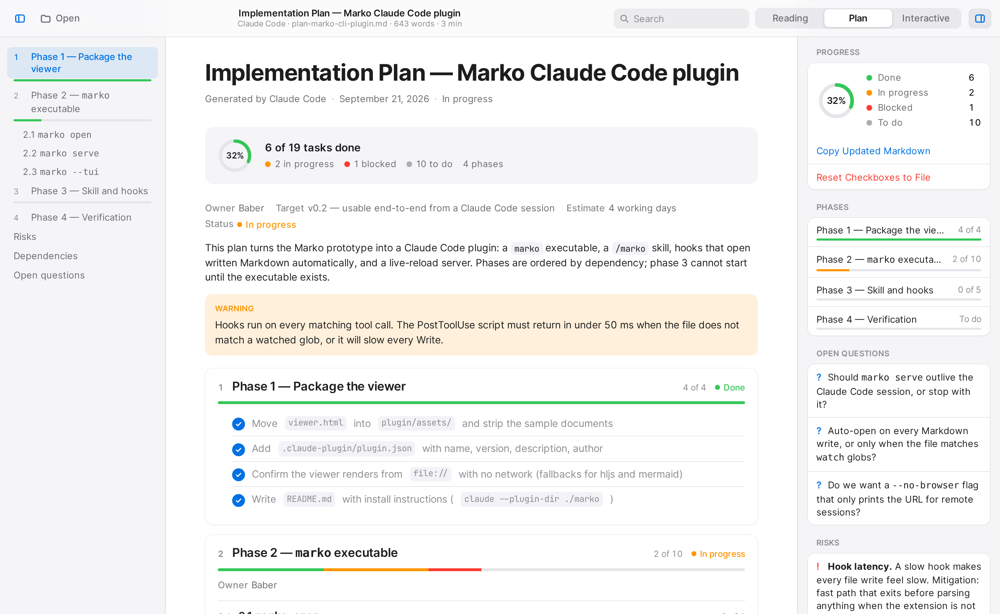
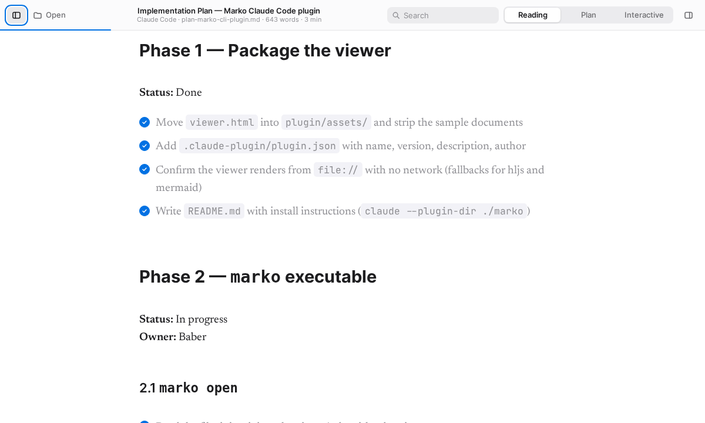
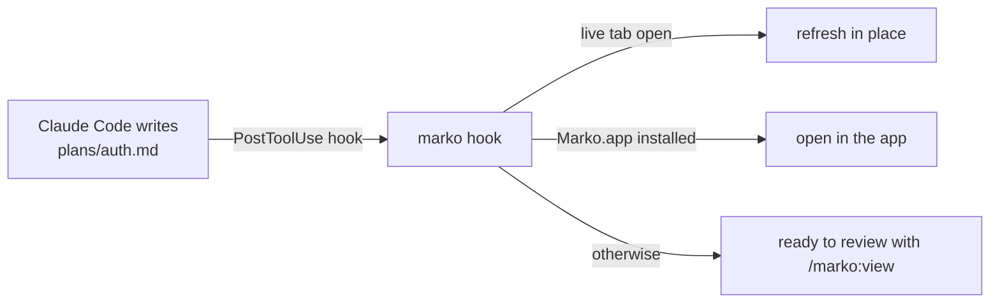
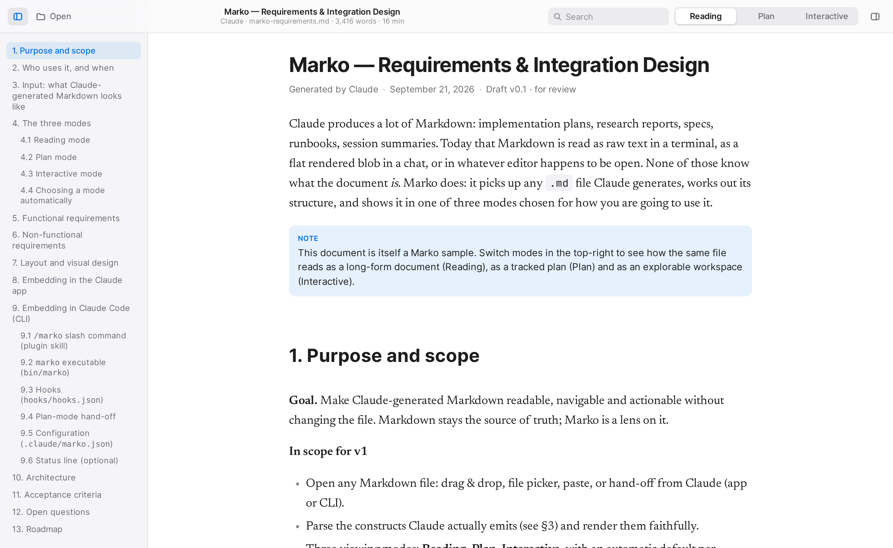
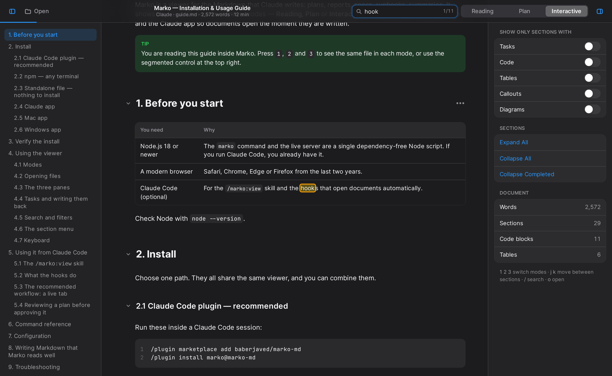

<p align="center">
  
</p>

<h1 align="center">Marko</h1>

<p align="center">
  <strong>A Markdown viewer for what Claude writes.</strong><br>
  Plans, reports, specs and runbooks — in the mode that fits: <b>Reading</b>, <b>Plan</b> or <b>Interactive</b>.
</p>

<p align="center">
  <a href="https://www.npmjs.com/package/marko-md"></a>
  <a href="https://github.com/baberjaved/marko-md/releases/latest"></a>
  <a href="https://github.com/baberjaved/marko-md/actions/workflows/ci.yml"></a>
  
  <a href="LICENSE"></a>
</p>

<p align="center">
  
</p>

## Why

Claude produces a lot of Markdown, and every tool treats it as plain text. An implementation plan is not an article — it has phases, tasks, blockers and open questions. A 4,000-word report shouldn't be read in a terminal. A runbook needs ticking, searching and folding.

Marko reads the file the way you're going to use it, and stays out of the way of the file itself: Markdown remains the source of truth, and Marko is a lens on it.

## Three modes, one file

<p align="center"></p>

| | Best for | What you get |
|---|---|---|
| **Reading** | Reports, specs, long documents | Serif body text at a comfortable width, outline with scroll tracking, reading time, no clutter |
| **Plan** | Implementation plans, roadmaps, checklists | Numbered phases with progress bars, round checkboxes, status labels from ✅ ⏳ 🚧 ❌ and `**Status:**` lines, a panel with open questions, risks and dependencies |
| **Interactive** | Runbooks, summaries, anything you work through | Collapsible sections, search that steps through matches, content filters, sortable tables, a "…" menu on every heading |

Marko picks the mode from the file (front matter, name, content) and remembers your choice. Tick tasks in Plan mode and **Copy Updated Markdown** hands you the file with the `[x]` marks written in.

## Install

Pick one — they share the same viewer.

**Claude Code plugin** (recommended)

```
/plugin marketplace add baberjaved/marko-md
/plugin install marko@marko-md
```

Adds `/marko:view <file>`, a `marko` command on Claude's PATH, and hooks that surface plans and reports the moment Claude writes them.

**npm**

```
npm install -g marko-md      # then: marko open plan.md
npx marko-md open plan.md    # no install
```

**Mac and Windows apps** — download from [Releases](https://github.com/baberjaved/marko-md/releases/latest) (`Marko-x.y.z.dmg` / `Marko-x.y.z-win-x64.zip`), or build in seconds:

```
app/mac/build.sh --install --default          # macOS: Command Line Tools only
.\app\windows\build.ps1 -Install -Default     # Windows: .NET 8 SDK
```

Both are ~1–2 MB, open `.md` files by double-click and reload when the file changes. [Mac details](app/mac/README.md) · [Windows details](app/windows/README.md)

**Nothing at all** — grab [`marko-viewer.html`](https://github.com/baberjaved/marko-md/releases/latest), open it in a browser, drag a file in.

## With Claude Code

```
marko serve            # leave running in a second terminal
```

Every plan or report Claude writes now appears in that tab and updates as Claude edits it. Review, tick, copy the ticks back, tell Claude what to change. Or ask for a file directly:

```
/marko:view plans/auth-migration.md
```



Config lives in `.claude/marko.json` (what to watch, which mode per folder, whether to auto-open). Full details in the **[Installation & Usage Guide](docs/guide.md)** — which is itself a Marko document.

<p align="center">
  
  
</p>

## Details that matter

- **Private.** No accounts, no telemetry, no uploads. `marko serve` binds to localhost only. The only network requests are three libraries from cdnjs, and the desktop apps bundle those.
- **Native look.** System fonts (San Francisco, New York and SF Mono on a Mac), light and dark, keyboard-first: `1` `2` `3` modes, `j` `k` sections, `/` search, `Esc` back.
- **Claude's dialect.** Front matter, task lists, `**Status:**` lines, callouts (`> **Note:**` and `> [!TIP]`), Mermaid diagrams, `🤖 Generated with Claude Code` footers — all understood.
- **Zero dependencies.** The CLI is one Node file. The viewer is one HTML file. The apps are one Swift file and one C# file.

## Roadmap

- Diff view between two revisions of the same document
- Save ticks straight back to the file from the apps
- Quick Look extension for macOS
- Tabs, folder mode, annotations

Ideas and issues welcome — [open one](https://github.com/baberjaved/marko-md/issues). If Marko is useful to you, a ⭐ helps others find it.

## Develop

```
npm run build     # src/viewer.template.html + samples → viewer/marko.html, dist/marko-demo.html
npm test          # CLI, hooks, live server
```

Tagging `vX.Y.Z` builds the Mac DMG and Windows zip and publishes a GitHub Release automatically.

## License

MIT © Baber Javed
