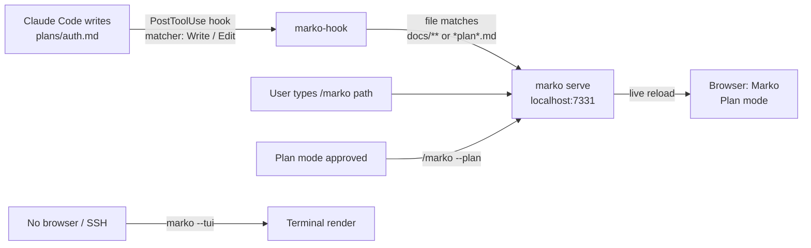
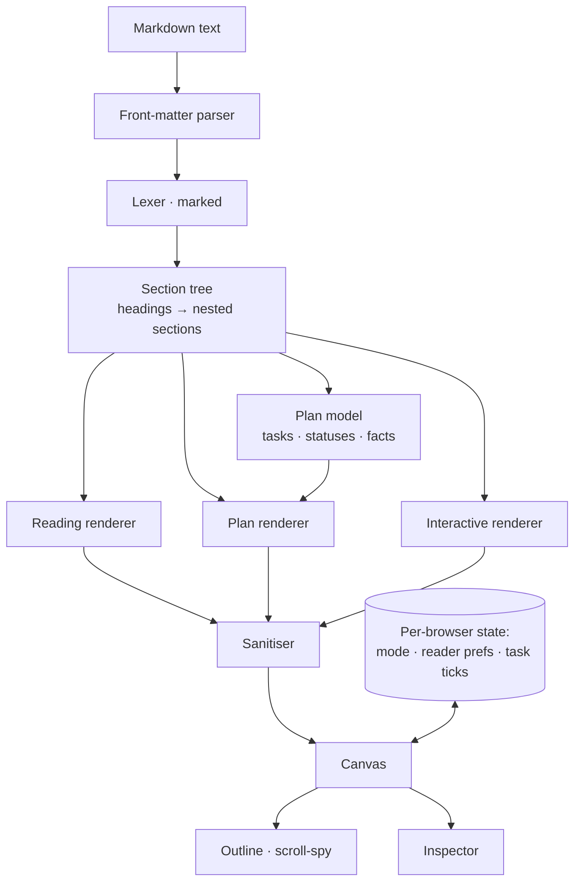

# Marko — a Markdown viewer for Claude output

Claude produces a lot of Markdown: implementation plans, research reports, specs, runbooks, session summaries. Today that Markdown is read as raw text in a terminal, as a flat rendered blob in a chat, or in whatever editor happens to be open. None of those know what the document *is*. Marko does: it picks up any `.md` file Claude generates, works out its structure, and shows it in one of three modes chosen for how you are going to use it.

> **Note:** This document is itself a Marko sample. Switch modes in the top-right to see how the same file reads as a long-form document (Reading), as a tracked plan (Plan) and as an explorable workspace (Interactive).

## 1. Purpose and scope

**Goal.** Make Claude-generated Markdown readable, navigable and actionable without changing the file. Markdown stays the source of truth; Marko is a lens on it.

**In scope for v1**

- Open any Markdown file: drag & drop, file picker, paste, or hand-off from Claude (app or CLI).
- Parse the constructs Claude actually emits (see §3) and render them faithfully.
- Three viewing modes: **Reading**, **Plan**, **Interactive**, with an automatic default per document.
- Integration into the Claude app (as a pinned artifact + a skill) and into Claude Code (as a plugin with a slash command, hooks and a live server).
- Work fully offline in a single HTML file. No accounts, no telemetry, no network.

**Out of scope for v1**

- Editing Markdown text (the file is edited where it lives — by Claude or in your editor).
- Multi-user collaboration or comments (v2 — see §13).
- Rendering non-Markdown formats.

## 2. Who uses it, and when

| Situation | Where | What they need | Mode |
|---|---|---|---|
| Reviewing a plan Claude Code just wrote before approving it | Terminal → browser | Phases, tasks, risks, what's blocked | Plan |
| Reading a 4,000-word research report in the Claude app | Claude app artifact | Comfortable long-form typography, outline, reading time | Reading |
| Working through a runbook while Claude executes steps | Side-by-side with the CLI | Check items off, collapse done sections, search | Interactive |
| Sharing a spec with a teammate who wasn't in the session | Shareable artifact link | Clean read, deep links to sections | Reading |
| Triaging a long session summary with 40 headings | Either | Search, filter to tables/code, focus one section | Interactive |

## 3. Input: what Claude-generated Markdown looks like

Marko is tuned for the dialect Claude writes rather than for arbitrary Markdown. Every construct below has a defined rendering in each mode.

| Construct | Typical Claude usage | Marko treatment |
|---|---|---|
| YAML front matter | `title`, `date`, `status`, `generated_by` | Parsed into the document header chips; never shown as raw text |
| `#`–`####` headings | Document → section → step | Section tree, outline, deep-link ids, scroll-spy |
| Task lists `- [ ]` / `- [x]` | Checklists, acceptance criteria | Live checkboxes; progress counted per section |
| Status markers | ✅ ⏳ 🚧 ❌ ⚠️, `**Status:** In progress`, `TODO`, `DONE`, `BLOCKED` | Normalised to one status vocabulary and shown as pills |
| Tables | Comparisons, requirement matrices, options | Responsive, horizontally scrollable, sortable in Interactive |
| Fenced code with a language | Snippets, configs, commands | Language chip, syntax highlighting, copy button, collapsed in Plan |
| ` ```mermaid ` fences | Flowcharts, sequence diagrams | Rendered as a diagram; source shown on failure |
| Blockquote callouts | `> **Note:**`, `> **Warning:**`, `> [!TIP]` | Callout with kind-specific colour and icon |
| Bold-label lines | `**Owner:** Baber`, `**Risk:** …` | Recognised as key/value facts; surfaced in Plan inspector |
| Numbered steps | Procedures, migrations | Ordered list; step numbers preserved in Plan mode |
| Nested bullets (3–4 levels) | Breakdowns, trees | Indented with guide lines; collapsible in Interactive |
| Links and inline code | References, file paths | Links open in a new tab; paths shown in mono |
| Footers such as `🤖 Generated with Claude Code` | Provenance | Detected and shown as a source chip (Claude / Claude Code) |
| Raw HTML (`<details>`, `<br>`) | Occasionally | Allowed after sanitising; scripts and event handlers stripped |

## 4. The three modes

The mode changes typography, density, which controls exist and what the inspector shows. It never changes the file.

### 4.1 Reading mode

For documents you read start to finish: reports, articles, specs, memos.

- Serif body face at a comfortable measure (≈ 65 characters), generous line height, larger type.
- Outline rail with scroll-spy; reading-progress bar; estimated reading time.
- Callouts, tables, code and diagrams rendered in place; nothing collapsed.
- Reader controls: type size, measure (narrow / normal / wide), line height. Remembered per browser.
- No checkboxes to toggle, no chevrons, no buttons inside the text. Reading mode is quiet on purpose.

### 4.2 Plan mode

For documents that describe work to be done: implementation plans, roadmaps, migration checklists, Claude Code plan-mode output.

- The section tree becomes **phases** (the highest heading level below the title) and **steps** (the next level). Phases are numbered because order carries meaning in a plan.
- Every task list item, status marker and `**Status:**` line is normalised to one of: `todo`, `in-progress`, `blocked`, `done`.
- A summary strip shows phases, tasks, per-status counts and overall completion. Each phase shows its own progress meter.
- Prose is de-emphasised, code blocks are collapsed behind a "Show code" toggle, and tables stay visible (they usually hold the decisions).
- Inspector: overall progress, status legend, **Open questions** (sections named Questions / Open questions, or lines ending in `?` under them), **Risks**, **Dependencies**, and a phase timeline you can click to jump.
- Checking a task updates progress immediately. **Copy updated Markdown** writes the checkbox state back into the original text so the file — not the viewer — stays the record.

### 4.3 Interactive mode

For working *with* the document: runbooks, long summaries, anything you search, filter and tick through.

- Sans-serif, denser layout; every section is collapsible; **Expand all / Collapse all**.
- Search-as-you-type with match highlighting; sections without a match fold away.
- Filters: show only sections that contain tasks, code, tables or callouts.
- Sortable tables (click a column header), copy buttons on code, line numbers.
- **Focus** a section to hide everything else; **Ask Claude about this section** copies a ready-made prompt with the section's Markdown.
- Keyboard: `j` / `k` move between sections, `/` jumps to search, `1` `2` `3` switch modes, `Esc` exits focus.

### 4.4 Choosing a mode automatically

Marko opens in the mode that fits the document, and the user can always override it.

1. Front matter `default_mode:` if present.
2. Filename hints: `*plan*.md`, `*roadmap*.md`, `*checklist*.md`, `TODO.md` → Plan.
3. Content heuristics: task items ≥ 5 **and** ≥ 30 % of list items are tasks, or ≥ 3 status markers → Plan.
4. Word count ≥ 1,500 with few tasks → Reading.
5. Otherwise → Interactive.

## 5. Functional requirements

| ID | Requirement | Priority |
|---|---|---|
| FR-1 | Open a `.md` / `.markdown` / `.txt` file by drag & drop, file picker or paste | Must |
| FR-2 | Accept a document embedded by Claude (data island in the page or `marko` CLI hand-off) | Must |
| FR-3 | Render every construct in §3 in all three modes | Must |
| FR-4 | Outline rail with scroll-spy and click-to-jump | Must |
| FR-5 | Mode switch (Reading / Plan / Interactive) with keyboard shortcuts | Must |
| FR-6 | Automatic default mode per §4.4, overridable | Must |
| FR-7 | Task checkboxes toggle in Plan and Interactive; progress recalculates | Must |
| FR-8 | Copy updated Markdown with checkbox state written back | Should |
| FR-9 | Search with highlighting; filters by content type | Should |
| FR-10 | Sortable tables, copy-code buttons, collapsible sections | Should |
| FR-11 | Reader controls (size, measure, line height) remembered per browser | Should |
| FR-12 | Mermaid diagrams rendered; syntax highlighting for common languages | Should |
| FR-13 | Provenance chip: detects `generated_by`, `Co-Authored-By: Claude`, "Generated with Claude Code" | Could |
| FR-14 | Deep links: `#section-slug` scrolls and highlights the section | Could |
| FR-15 | Open multiple documents in tabs | Could (v2) |

## 6. Non-functional requirements

- **Single file.** One HTML file, ≤ 400 KB without embedded documents, no build step to run it. Libraries pinned and loaded from a CDN with a graceful fallback (plain code blocks if highlighting or Mermaid fail to load).
- **Speed.** A 2 MB Markdown file parses and renders in under 300 ms on a 2020 laptop; mode switches re-render in under 100 ms.
- **Offline & private.** No network calls for the document. Nothing leaves the browser.
- **Accessible.** Keyboard-operable throughout; visible focus; headings and landmarks preserved; contrast ≥ 4.5:1 in both themes; respects `prefers-reduced-motion`.
- **Themed.** Follows the host's light/dark theme (the Claude app's, or the OS's when opened from the CLI) with a system-native palette; no web fonts are loaded, so it renders identically offline.
- **Responsive.** Usable at phone width; rails collapse into toggles; tables and code scroll within their own container.
- **Safe.** Raw HTML in the document is sanitised: no scripts, no inline event handlers, no `javascript:` links.

## 7. Layout and visual design

Marko follows the conventions of a native Mac document app rather than a web dashboard: content first, chrome that recedes, and controls that appear only where they are needed.

```
┌────────────────────────────────────────────────────────────────────────┐
│ ▤  Open ▾        Implementation Plan — Marko plugin        🔍  [Reading │ Plan │ Interactive]  ▥ │
├──────────────┬──────────────────────────────────────┬──────────────────┤
│ OUTLINE      │ DOCUMENT                             │ PANEL            │
│ Phase 1  ━━  │ typography and density set by mode   │ grouped rows,    │
│ Phase 2  ━   │                                      │ only what the    │
│   2.1        │ Reading · New York, 66 characters    │ mode needs       │
│ Phase 3      │ Plan · numbered phases, round checks │                  │
│ Risks        │ Interactive · dense, collapsible     │                  │
└──────────────┴──────────────────────────────────────┴──────────────────┘
```

- **Toolbar** — one translucent bar over all three panes (content scrolls beneath it). Left: outline toggle and a single **Open** menu (file, paste, samples). Centre: document title with a one-line subtitle (source · file · words · reading time). Right: search field, a segmented control for the mode, panel toggle. A hairline under the bar doubles as the reading-progress indicator.
- **Outline** (left, 232 px) — heading tree with scroll-spy; in Plan mode each phase carries a thin progress line. Numbers appear only when the document doesn't already number its headings.
- **Document** (centre) — white ground, generous margins, measure and type set by the mode.
- **Panel** (right, 284 px) — grouped rows in the style of System Settings: Reading shows text size and width plus document facts; Plan shows a progress ring, phases, open questions, risks and dependencies; Interactive shows content filters as switches and section actions. Hidden by default in Reading mode; the choice is remembered per mode.
- **Type** — the platform's own faces: San Francisco for UI and headings, New York for Reading mode body text, SF Mono for code (with Segoe UI / Georgia / Consolas fallbacks elsewhere).
- **Colour** — system palette: one blue accent for selection and links; green, orange and red only for task status; everything else is grey on white. Dark mode mirrors the macOS dark palette.
- **Controls** — round Reminders-style checkboxes, a sliding segmented control, hover-revealed "…" section menus (Focus, Ask Claude, Copy as Markdown), switches for filters, frosted menus and HUD-style toasts.
- Below 960 px the outline and panel become slide-over sheets and the toolbar wraps to two rows.

## 8. Embedding in the Claude app

Marko lives in the Claude app as a **published artifact** — a private page with its own link that the user can pin to the sidebar and share.

**How a document gets in**

1. **Claude hands it over.** A small `marko` skill tells Claude: whenever you produce a Markdown deliverable (plan, report, spec, summary), publish the Marko viewer with the document embedded in its data island and `default_mode` set — Plan for plans, Reading for reports. The user gets one card in the conversation: the document, already in the right mode.
2. **The user drops it in.** Open the pinned Marko artifact, drag any `.md` from the desktop, or paste Markdown copied from a chat. Nothing is uploaded; it renders locally.
3. **Republish, don't rebuild.** When Claude revises the document it republishes the same artifact, so the link — and anything a teammate bookmarked — stays valid.

**Skill sketch** (`~/.claude/skills/marko/SKILL.md`, also usable as an account skill in the app):

```yaml
---
name: marko
description: Publish Markdown deliverables (plans, reports, specs, summaries) in the Marko viewer artifact with the right mode preselected.
---
When the deliverable is Markdown the user will read, review or track:
1. Write the Markdown as usual (front matter with title, date, status, default_mode).
2. Publish the Marko viewer (marko.html) with the document placed in the
   <script type="text/markdown" id="doc"> island; set data-name and
   data-mode on that island. Reuse the existing Marko URL for revisions.
3. In the reply, give one line: what the document is and which mode it opened in.
```

**Why an artifact and not an inline reply.** Inline Markdown in a chat is flat: no outline, no progress, no search, and it scrolls away. An artifact is a stable page that keeps its state, opens on any device and can be handed to someone else.

## 9. Embedding in Claude Code (CLI)

Marko ships as a Claude Code **plugin** — `claude --plugin-dir ./marko` for local use, or install from a marketplace — made of four parts. Each works on its own; together they make Markdown output visible the moment Claude writes it.



### 9.1 `/marko` slash command (plugin skill)

`skills/marko/SKILL.md` in the plugin; invoked as `/marko <path> [--mode plan|reading|interactive]`.

```yaml
---
name: marko
description: Open a Markdown file in the Marko viewer. Use after writing a plan, report or spec the user should review.
allowed-tools: [Bash, Read]
---
Run `marko open "$ARGUMENTS"`. If no path is given, open the most recently
written .md file in this session (marko keeps a list). Report the URL in one line.
```

### 9.2 `marko` executable (`bin/marko`)

| Command | What it does |
|---|---|
| `marko open <file> [--mode m]` | Writes a self-contained copy of the viewer with the file embedded to `~/.cache/marko/<hash>.html` and opens it in the default browser. Zero-dependency path; works everywhere. |
| `marko serve [dir] [--port 7331]` | Tiny local server: serves the viewer at `/`, the file at `/f/<path>`, and pushes reload events when a watched file changes. This is what makes "Claude edits → view updates" instant. |
| `marko --tui <file>` | Terminal rendering (Reading mode only) for SSH and headless sessions. |
| `marko recent` | Lists the Markdown files written in the current session, newest first. |

### 9.3 Hooks (`hooks/hooks.json`)

- **`PostToolUse`** with matcher `Write|Edit|MultiEdit`: the hook script reads the JSON on stdin, checks `tool_input.file_path` against the configured globs, and if it matches, tells the running `marko serve` to reload (or prints a one-line `View: http://localhost:7331/f/plans/auth.md` via `systemMessage` if no server is running). Claude's own flow is not interrupted.
- **`Stop`**: if any Markdown files were written during the turn, append one line listing them with their Marko links, so the user never has to hunt for what was produced.
- **`SessionStart`**: optionally start `marko serve` in the background when the project has a `.claude/marko.json`.

```json
{
  "hooks": {
    "PostToolUse": [
      { "matcher": "Write|Edit|MultiEdit",
        "hooks": [ { "type": "command", "command": "marko hook post-tool-use" } ] }
    ],
    "Stop": [
      { "hooks": [ { "type": "command", "command": "marko hook stop" } ] }
    ]
  }
}
```

### 9.4 Plan-mode hand-off

Claude Code's plan mode presents the plan in the transcript. To review it in Marko, the `marko` skill instructs Claude to also write the plan to `.claude/plans/<slug>.md` before asking for approval; the PostToolUse hook then opens it in Plan mode automatically. Approving in the terminal and ticking tasks in Marko are independent: the file is the record, and **Copy updated Markdown** brings checked state back.

### 9.5 Configuration (`.claude/marko.json`)

```json
{
  "watch": ["docs/**/*.md", "plans/**/*.md", "*.PLAN.md", "README.md"],
  "autoOpen": true,
  "port": 7331,
  "modeByGlob": { "plans/**": "plan", "docs/**": "reading", "runbooks/**": "interactive" }
}
```

### 9.6 Status line (optional)

A status-line command can show a small counter — `▣ 3 docs` — of Markdown files written this session, so a long-running task leaves a visible trail. (The status-line input schema varies by version; the plugin treats this as optional.)

## 10. Architecture



- **Parser.** `marked` (pinned) produces tokens; Marko walks them once into a section tree. Rendering is per mode from the same tree, so a mode switch never re-parses.
- **Plan model.** Built from the tree: tasks (with source line index so state can be written back), status markers, `**Key:** value` facts, and named sections (Risks, Dependencies, Open questions).
- **Sanitiser.** Rendered HTML is parsed into a detached template; `script`, `style`, `iframe`, `object`, `embed`, `form` elements are removed, `on*` attributes and `javascript:` URLs stripped.
- **State.** Mode, reader preferences and task ticks are stored per browser (local storage, keyed by a hash of the document) and treated as conveniences: the page works with storage unavailable.
- **Libraries.** `marked` for parsing, `highlight.js` for code, `mermaid` for diagrams — all optional at runtime; the viewer degrades to plain blocks if any is missing.

## 11. Acceptance criteria

- [x] Opens the bundled sample documents in the correct default mode
- [x] Drag & drop, file picker and paste all load a document
- [x] All three modes render the constructs in §3
- [x] Task ticks update progress and can be written back to Markdown
- [x] Search highlights matches and folds non-matching sections
- [x] Outline scroll-spy tracks the visible section in all modes
- [ ] Mermaid and syntax highlighting degrade gracefully when the CDN is unreachable
- [ ] Verified at 400 px width and in both themes
- [ ] `marko` plugin installs with `claude --plugin-dir` and the PostToolUse hook opens a written plan
- [ ] Skill published for the Claude app; Claude hands a plan to Marko without being asked twice

## 12. Open questions

- Should Plan mode treat **H2 or H3** as the phase level when both exist, or always the highest level below the title?
- Do you want the CLI to **auto-open a browser** on every Markdown write, or only on `/marko` and plan-mode hand-off?
- Is **Interactive** mode meant to include annotations / comments (v2), or is it strictly navigate-search-tick?
- Should the app-side skill publish **one artifact per document** or reuse a single pinned Marko and swap the document?
- Which Markdown files should be excluded by default (`CHANGELOG.md`, `node_modules/**`, `CLAUDE.md`)?

## 13. Roadmap

| Version | Adds |
|---|---|
| v0.1 (this prototype) | Three modes, drop/paste/open, outline, plan model, write-back, search, sortable tables, samples |
| v0.2 | Plugin packaging: `marko` binary, `serve` with live reload, hooks, `.claude/marko.json` |
| v0.3 | App skill; artifact comments routed to Claude; deep links |
| v1.0 | Multiple tabs, diff view between two revisions of the same document, TUI mode |
| v2 | Annotations, section-level "ask Claude" via the artifact runtime, export to PDF/Docx |

---

🤖 Generated with Claude Code · Draft for review by Baber · 2026-09-21
